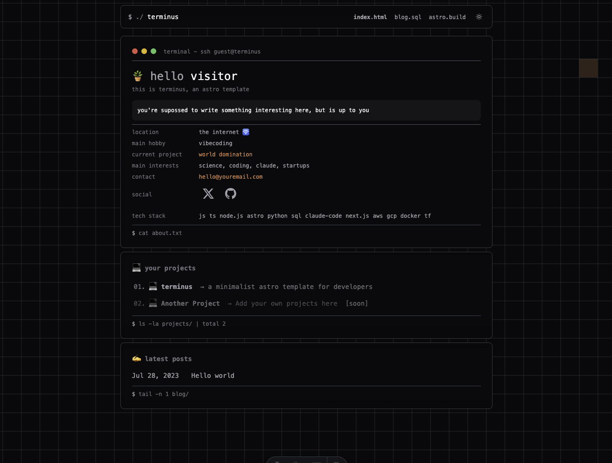

# 🌱 Terminus

> A minimalist Astro template for developers



Demo: https://ojoanalogo.github.io/terminus-astro-template/

## ✨ Features

- 🚀 **Astro 5.x** - Fast, content-focused web framework
- 🎨 **Tailwind CSS** - Utility-first CSS framework with typography plugin
- 📱 **Responsive Design** - Mobile-first approach
- 📝 **Blog Ready** - Built-in blog functionality with markdown support
- 🚀 **GitHub Pages Deployment** - Automated deployment via GitHub Actions

## 🛠️ Prerequisites

- **Node.js** 18+
- A computer (optional)

## 🚀 Quick Start

1. **Clone the repository**

   ```bash
   git clone https://github.com/ojoanalogo/terminus-astro-template.git
   cd terminus-astro-template
   ```

2. **Install dependencies**

   ```bash
   npm install
   ```

3. **Start the development server**

   ```bash
   npm run dev
   ```

4. **Open your browser**
   Navigate to `http://localhost:4321` to see your site!

## 📁 Project Structure

```txt
terminus/
├── public/              # Static assets (favicon, images, etc.)
├── src/
│   ├── assets/         # Images, fonts, and other assets
│   ├── components/     # Reusable Astro components
│   │   ├── BaseHead.astro
│   │   ├── Header.astro
│   │   ├── PostPreview.astro
│   │   └── ...
│   ├── content/        # Content collections (blog posts, etc.)
│   │   ├── blog/       # Blog posts in markdown
│   │   └── config.ts   # Content collection configuration
│   ├── layouts/        # Page layouts
│   │   ├── BaseLayout.astro
│   │   └── PostLayout.astro
│   ├── pages/          # File-based routing
│   │   ├── blog/       # Blog pages
│   │   ├── index.astro # Homepage
│   │   └── 404.astro   # Custom 404 page
│   ├── styles/         # Global CSS styles
│   ├── utils/          # Utility functions
│   └── config.ts       # Site configuration
├── astro.config.mjs    # Astro configuration
├── tailwind.config.cjs # Tailwind CSS configuration
└── package.json        # Dependencies and scripts
```

## 🎨 Customization

### Site Configuration

Edit `src/config.ts` to customize your site:

```typescript
export const SITE_TITLE = "Your Site Title";
export const SITE_DESCRIPTION = "Your site description";
```

### Astro Configuration

Modify `astro.config.mjs` to:

- Update the site URL for production
- Add new integrations
- Configure build options

## 📝 Adding Content

### Blog Posts

Create new blog posts in `src/content/blog/`:

```markdown
---
title: "Your Post Title"
description: "Post description"
pubDate: "2024-01-15"
---

Your content here...
```

### Pages

Add new pages in the `src/pages/` directory. Astro uses file-based routing:

- `src/pages/about.astro` → `/about`
- `src/pages/contact/index.astro` → `/contact`

## 🚀 Deployment

This template is configured for **automatic deployment to GitHub Pages** using GitHub Actions.

### Setup GitHub Pages Deployment

1. **Fork or use this template** to create your repository
2. **Enable GitHub Pages** in your repository settings:
   - Go to Settings → Pages
   - Select "GitHub Actions" as the source
3. **Update the site URL** in `astro.config.mjs`:

   ```javascript
   export default defineConfig({
     site: "https://yourusername.github.io/your-repo-name",
     // ... other config
   });
   ```

4. **Push to main branch** - deployment happens automatically!

## 📄 License

MIT

---

## 🤝 Contributing

Contributions, issues, and feature requests are welcome!
